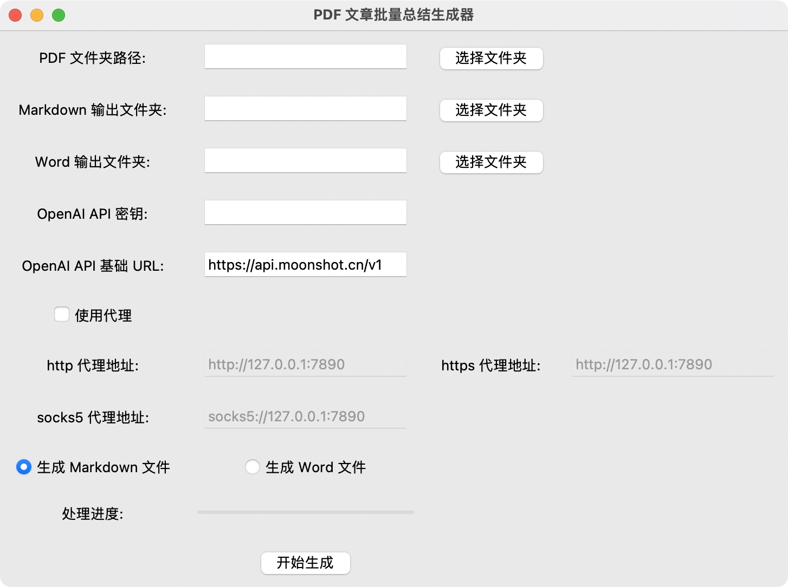
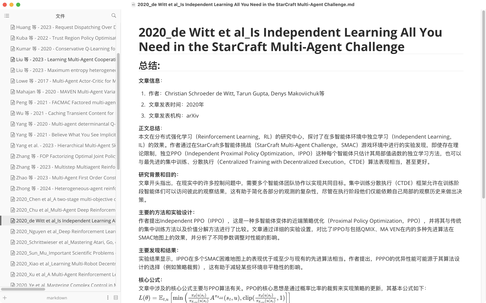

# SummaryMaster
通过大语言模型帮助你快速了解一篇 pdf 论文的主要内容


## 界面是这个样子：



## 效果是这个样子：



# 使用方法：
## 直接使用release 中打包好的软件
1. 如果是使用 mac，由于苹果的安全限制，首先需要将软件拖入 访达的 `应用程序/Application` 中，然后打开 terminal 使用```sudo xattr -cr /Applications/SummaryMasterProxy.app``` 命令对其进行解除限制
2. 输入自己的 apikey，最好使用月之暗面 moonshot 的，因为其他很多厂商不支持上传 pdf 文件和 ocr
3. 如果开了代理，需要点击开启代理，修改为自己的代理端口，默认为 clash 的 127.0.0.1:7890 端口
4. 生成 word 文档目前还不太 ok，生成的格式还需要调整

## 使用代码
1. 首先创建一个新的conda 环境
   ```
   conda create --name summary_master
   conda activate summary_master
   ```
2. 下载依赖
   ```
   pip install -r requirements.txt
   ```
3. 启动脚本
   ```
   python scripts/SummaryProxy.py
   ```


## 待办事项

- [x] 完成项目文档
- [x] 提交代码
- [x] 兼容性：
  - [x] windows
  - [x] mac M 系列
  - [x] mac intel
  - [ ] Web based
- [ ] 增加自定义 prompt 选项
- [ ] 增加拖拽放入文件
  - [ ] 增加拖拽放入pdf 文件选项
  - [ ] 增加拖拽放入word 文件选项
- [ ] 网页版实现
- [ ] UI 美化
- [ ] 实现多文档格式输出
- [ ] 整合图像输出
  - [ ] markdown
  - [ ] word

